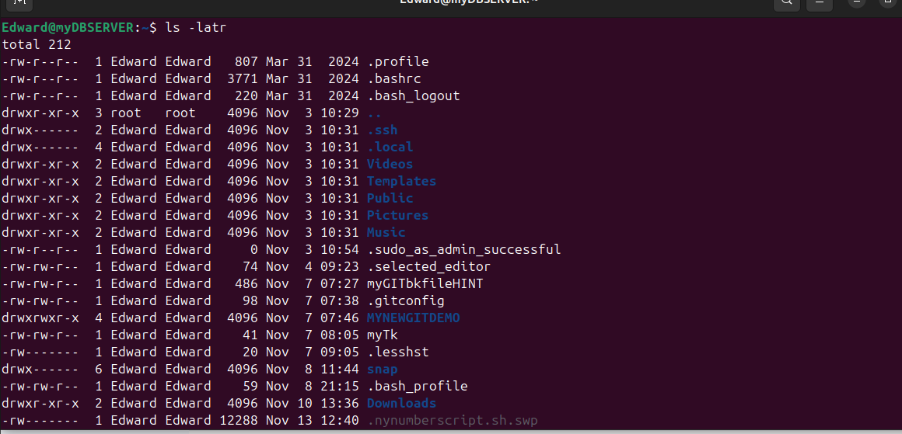
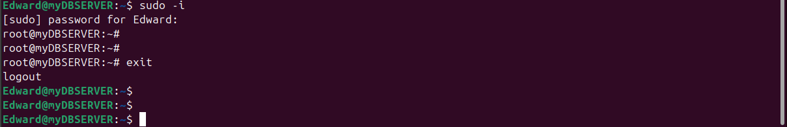
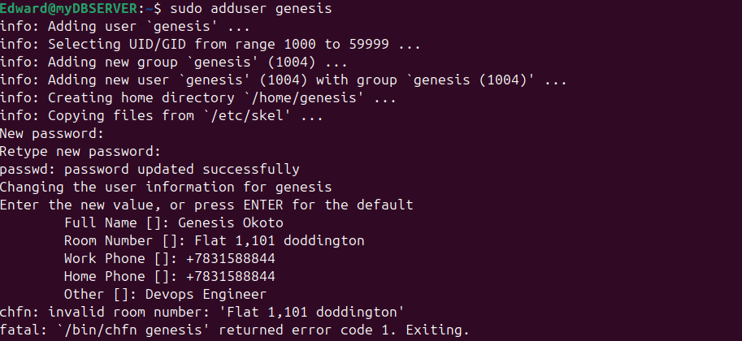
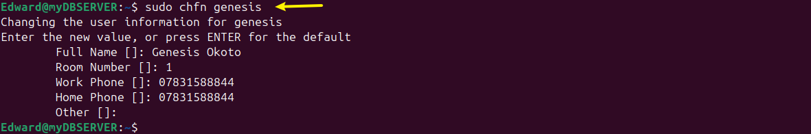

# Advanced Linux Commands

### File Permissions and Access Rights.

Understanding how to manage file permissions and ownership is crucial in linux.This knowledge empowers you to control access to files and directories,ensuring the security and integrity of your system.

### Numeric Representation of Permissions

In linux,permissions are represented using numeric values.Each permission (no permission, read, write and execute) is assigned a numeric value.

No permission = 0

Read  = 4

write = 2, and

execute = 1

These values are combined to represent the permission for each user class.Lets confider a few example

**Permissions represented by 7**.

In Unix-based systems, file permissions are represented by a set of three numbers. Each number can range from 0 to 7 and represents the permissions for the owner, group, and others.

The number 7 represents **full permissions**: read, write, and execute. It’s the result of adding the individual permission values:

- **Read (4)**
- **Write (2)**
- **Execute (1)**

So, 7 = 4 (read) + 2 (write) + 1 (execute).

symbolic : rwx

For example, if you set file permissions to 777, it means the owner, group, and others all have read, write, and execute permissions. This is typically represented like this in the `chmod` command:
```bash
chmod 777 filename
```

Use this level of access cautiously, as it gives all users full control over the file or directory.


**Permissions represented by 5**.

In Unix-based systems, the number 5 represents **read and execute** permissions. It is the sum of:

- **Read (4)**
- **Execute (1)**

So, 5 = 4 (read) + 1 (execute).

symbolic : r-x

When a file or directory is assigned a permission of 5, the user can read and execute it, but not write to it.

For example, setting the permissions to 755 for a file means the owner has full permissions (7), while the group and others have read and execute permissions (5). This is typically represented like this in the `chmod` command:
```bash
chmod 755 filename
```


**Permissions represented by 6**.

In Unix-based systems, the number 6 represents **read and write** permissions. It is the sum of:

- **Read (4)**
- **Write (2)**

So, 6 = 4 (read) + 2 (write).

symbolic : rw-

When a file or directory is assigned a permission of 6, the user can read and write to it, but not execute it.

For example, setting the permissions to 664 for a file means the owner and group have read and write permissions (6), while others have read permissions (4). This is typically represented like this in the `chmod` command:
```bash
chmod 664 filename
```

Use this level of access to grant appropriate permissions without allowing execution.


## Shorthand Representation of Permissions

The shorthand representation of file permissions in Unix-based systems is a three-digit octal (base-8) number. Each digit represents the permissions for the owner, group, and others, respectively. The digits range from 0 to 7, corresponding to different combinations of read (r), write (w), and execute (x) permissions:

- **7**: read (4) + write (2) + execute (1) = rwx
- **6**: read (4) + write (2) = rw-
- **5**: read (4) + execute (1) = r-x
- **4**: read (4) = r--
- **3**: write (2) + execute (1) = -wx
- **2**: write (2) = -w-
- **1**: execute (1) = --x
- **0**: no permissions = ---

For example, the permission `754` would be represented as:

- **Owner**: 7 (rwx)
- **Group**: 5 (r-x)
- **Others**: 4 (r--)

This shorthand notation is commonly used with the `chmod` command to set permissions for files and directories.

## The role of Hyphen (-) in permission representation

In Unix-based systems, hyphens (`-`) in permission representation indicate the absence of specific permissions for a file or directory. Permissions are displayed in a 10-character string:

- The first character represents the file type (e.g., `-` for a regular file, `d` for a directory).
- The next nine characters are grouped into three sets of three: owner, group, and others.

Each set consists of three characters representing **read (r)**, **write (w)**, and **execute (x)** permissions. A hyphen (`-`) replaces the character if the corresponding permission is not granted.

For example, the permission string `-rw-r--r--` means:

- **Owner**: read and write (rw-)
- **Group**: read (r--)
- **Others**: read (r--)

The hyphens in the string denote the absence of specific permissions (write and execute) for the group and others.

Lets get into a linux terminal and run `ls -latr`

    ls -latr



Sure! Let's break down each part of the output:

### Example Line
```plaintext
-rw-r--r--  1 Edward Edward  807 Mar 31  2024 .profile
```

### Breakdown:
1. **File Type and Permissions** (`-rw-r--r--`):
   - **`-`**: Indicates a regular file (other types include `d` for directories, `l` for symlinks, etc.).
   - **`rw-`**: The owner has read and write permissions.
   - **`r--`**: The group has read-only permissions.
   - **`r--`**: Others have read-only permissions.

2. **Number of Links** (`1`):
   - Represents the number of hard links to the file or directory.

3. **Owner** (`Edward`):
   - The username of the file's owner.

4. **Group** (`Edward`):
   - The group name associated with the file.

5. **File Size** (`807`):
   - The size of the file in bytes.

6. **Modification Date and Time** (`Mar 31  2024`):
   - The last modification date and time of the file.

7. **File Name** (`.profile`):
   - The name of the file or directory.

### Example Directory Line:
```plaintext
drwxr-xr-x  3 root   root    4096 Nov  3 10:29 ..
```

### Breakdown:
1. **File Type and Permissions** (`drwxr-xr-x`):
   - **`d`**: Indicates a directory.
   - **`rwx`**: The owner has read, write, and execute permissions.
   - **`r-x`**: The group has read and execute permissions.
   - **`r-x`**: Others have read and execute permissions.

2. **Number of Links** (`3`):
   - Represents the number of directories within the directory, including the directory itself (`.`) and the parent directory (`..`).

3. **Owner** (`root`):
   - The username of the directory's owner.

4. **Group** (`root`):
   - The group name associated with the directory.

5. **File Size** (`4096`):
   - The size of the directory in bytes (usually 4096 bytes for directories).

6. **Modification Date and Time** (`Nov  3 10:29`):
   - The last modification date and time of the directory.

7. **Directory Name** (`..`):
   - The name of the directory (in this case, the parent directory).

I hope this detailed breakdown helps! If you have any specific questions about other parts of the output, feel free to ask.

## File Permissions Commands

To manage file permissions and ownership,Linux provides several Commands

`chmod command`

The `chmod` command in Unix-based systems is used to change the permissions of a file or directory. These permissions dictate who can read, write, or execute the file.

Here's a quick overview:

- **Syntax**:
  ```bash
  chmod [options] mode filename
  ```

- **Mode**:
  - You can specify permissions using symbolic or numeric mode.
  - **Symbolic mode**: `r` (read), `w` (write), `x` (execute).
    ```bash
    chmod u+x filename  # Adds execute permission for the owner (user).
    ```
  - **Numeric mode**: Sum of read (4), write (2), and execute (1).
    ```bash
    chmod 755 filename  # Owner: read, write, execute. Group: read, execute. Others: read, execute.
    ```

Use `chmod` to ensure that files and directories have the appropriate permissions for their intended use.

 The `u+x` notation in the `chmod` command is a symbolic mode used to change file permissions in Unix-based systems. Let's break it down:

### Symbolic Mode Components
- **`u` (user)**: Represents the file's owner.
- **`+` (plus sign)**: Adds the specified permission(s).
- **`x` (execute)**: The permission being added, in this case, execute permission.

### Detailed Explanation
When you use `chmod u+x filename`, you are modifying the permissions of the `filename` such that the **owner** (user) of the file is granted execute permission. Here’s how it works:

1. **Current Permissions**:
   Suppose the current permissions of a file are `-rw-r--r--`, which means:
   - Owner: read and write (`rw-`)
   - Group: read-only (`r--`)
   - Others: read-only (`r--`)

2. **Applying `chmod u+x filename`**:
   - This command adds execute (`x`) permission to the owner's existing permissions.
   - Resulting permissions become `-rwxr--r--`.

3. **Resulting Permissions**:
   - Owner: read, write, and execute (`rwx`)
   - Group: read-only (`r--`)
   - Others: read-only (`r--`)

### Example
Let's say we have a script named `myscript.sh`:

```bash
ls -l myscript.sh
```
Output:
```plaintext
-rw-r--r-- 1 Edward Edward 204 Nov 13 13:00 myscript.sh
```

Apply the `chmod` command:
```bash
chmod u+x myscript.sh
```
Check the new permissions:
```bash
ls -l myscript.sh
```
Output:
```plaintext
-rwxr--r-- 1 Edward Edward 204 Nov 13 13:00 myscript.sh
```

Now, the owner of `myscript.sh` can execute the script.

`Same logic applies for the group and others..`

**When adding execute permission to the group using the `chmod` command, you use the symbolic mode `g+x`:**

- **`g` (group)**: Specifies that the change applies to the group.
- **`+` (plus sign)**: Adds the specified permission.
- **`x` (execute)**: The permission being added.

### Example
Suppose the current permissions of a file are `-rw-r--r--`:

```bash
ls -l filename
```
Output:
```plaintext
-rw-r--r-- 1 Edward Edward 204 Nov 13 13:00 filename
```

To add execute permission for the group:
```bash
chmod g+x filename
```

Check the new permissions:
```bash
ls -l filename
```
Output:
```plaintext
-rw-r-xr-- 1 Edward Edward 204 Nov 13 13:00 filename
```

**To add execute permission to others using the `chmod` command, you use the symbolic mode `o+x`:**

- **`o` (others)**: Specifies that the change applies to others.
- **`+` (plus sign)**: Adds the specified permission.
- **`x` (execute)**: The permission being added.

### Example
Suppose the current permissions of a file are `-rw-r--r--`:

```bash
ls -l filename
```
Output:
```plaintext
-rw-r--r-- 1 Edward Edward 204 Nov 13 13:00 filename
```

To add execute permission for others:
```bash
chmod o+x filename
```

Check the new permissions:
```bash
ls -l filename
```
Output:
```plaintext
-rw-r--r-x 1 Edward Edward 204 Nov 13 13:00 filename
```

Now, others have execute permission (`r-x`). The mode `o+x` ensures that others can execute the file while maintaining existing read permissions.


`chown command`

The `chown` command in Unix-based systems is used to **change the ownership** of files or directories. It modifies the user and/or group ownership.

### Syntax
```bash
chown [options] newowner:newgroup filename
```

### Examples
1. **Change the owner of a file**:
   ```bash
   chown newowner filename
   ```

2. **Change the owner and group of a file**:
   ```bash
   chown newowner:newgroup filename
   ```

3. **Change the owner of a directory and its contents recursively**:
   ```bash
   chown -R newowner directoryname
   ```

Use the `chown` command to assign proper ownership to files and directories, ensuring the correct users and groups have the appropriate access rights.


## Superuser Priviledges

Superuser privileges, often referred to as **root** access, grant a user full control over a Unix-based system. With these privileges, the user can:

- **Install and remove software**.
- **Modify system files and configurations**.
- **Create and manage user accounts**.
- **Access and modify any file**, regardless of permissions.

Superuser privileges are typically accessed using the `sudo` command, which allows a regular user to perform administrative tasks temporarily. It’s essential to use these privileges cautiously, as improper use can affect system stability and security.
To use the Superuser privileges,simply type `sudo` before the command you would be invoking

To switch to the root user, simply run.

    sudo -i

You can type `exit` to leave the shell.



## User management On Linux.

### Creating a user

Creating a user in Ubuntu involves a few simple steps:

1. **Open Terminal**: Use `Ctrl+Alt+T` to open it.
2. **Add New User**: Run:
   ```bash
   sudo adduser username
   ```
   Replace `username` with your desired name. You'll be prompted to set a password and fill in optional user information.




There was an error message because the an invalid room number is should be
simply a numeric value.

You can revisit this by running:

    sudo chfn genesis # genesis is user created:Replace with your own user




The home directory represents the file system created in the name of the user.
Such as `/home/genesis`. This is where each user created on the server will store 
their respective data.


## Granting administrative Priviledges

By default, To grant administrative privileges to a user in Ubuntu, you need to add them to the `sudo` group. Users in this group can perform administrative tasks with the `sudo` command.

### Steps:
1. **Open Terminal**: Press `Ctrl+Alt+T`.

2. **Add User to `sudo` Group**: Use the `usermod` command. Replace `username` with the user's name (e.g., `genesis`).
   ```bash
   sudo usermod -aG sudo username
   ```

### Example:
To grant `genesis` administrative privileges, run:
```bash
sudo usermod -aG sudo genesis
```
### Breakdown:

1. **`sudo`**:
   - This prefix allows the command to be executed with superuser (administrative) privileges.
   - Ensures that the user running the command has the necessary permissions to modify user accounts.

2. **`usermod`**:
   - This is the command used to modify a user account in the system.
   - It allows you to change a user's attributes, such as group memberships and login details.

3. **`-a`**:
   - Stands for "append."
   - It ensures that the user is added to the specified group(s) without being removed from other groups they are already a member of.
   - It's essential for safely adding a user to new groups without affecting their existing memberships.

4. **`-G`**:
   - This option specifies the group(s) to which the user will be added.
   - Multiple groups can be specified, separated by commas, but in this case, we're adding to a single group.

5. **`sudo`** (as an argument to `-G`):
   - This is the group name.
   - By adding the user to the `sudo` group, the user gains the ability to execute commands with superuser privileges using the `sudo` command.

6. **`genesis`**:
   - The username of the account being modified.
   - This specifies that the changes should be applied to the user account named `genesis`.


3. **Verify**: You can check if the user has been added to the `sudo` group:
   ```bash
   groups genesis
   ```

The output should include `sudo`, confirming the user has been granted administrative privileges. Now, `genesis` can execute commands with superuser privileges using `sudo`.


## Switching User account

To start using the system as another user, you will need to use the `su` command to switch.

To switch to another user, use the `su` command followed by the username
For example, to switch to jeffery account, run 

    su jeffery

You will be prompted to enter the password for the user.Once authenticated,you will
switch to the users environment.

## Modifying User Account.

### Changing User Password

 To change the password for a user, use the `passwd` command followed by the username.
 For example,to change the password for generis,run.

    sudo passwd genesis

You will be prompted to enter and confirm the new password for the user.

### Creating a Group

To create a new group,use the `groupadd` command.To create a group called **developers**

    sudo groupadd developers

### Adding Users To The Group

Use the `usermod` command to add users to the group.For instance,to add users "john" and "jane"

to the "developers" group.

    sudo usermod -aG developers johndoe

The `-aG` options append the "developers" group to the users existing
group memberships.


### Verifying Group memberships

To confirm the group memberships for a specific user, use the `id` command.
For example,to check the group memberships for the user "johndoe"

    id johnoe

This command displays information about the user "johndoe" including the groups
they belong to, such as "developers"


### Deleting a User

To delete a user, run the command below

    sudo userdel username

### Ensuring Proper Group Permission.

Groups in linux are often used to manage permissions for files and directories.
Ensure that the relevant files or directories have the appropriate group ownership
and permissions.For example,to grant the "developers" group ownership of a directory.


    sudo chown :developers /path/to/directory

And to grant read and write permissions to the group.

    sudo chmod g+rw /path/to/directory


